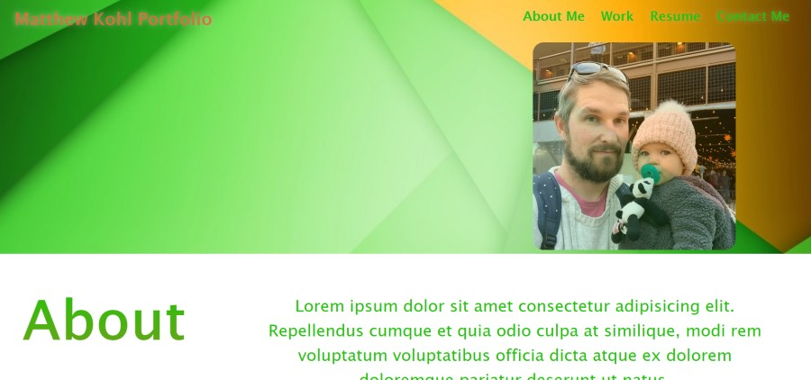

<h1 align="center">Matthew Kohl Portfolio</h1>

    
    

    

## Table of Contents
- [Description](#description)
- [Github](#github)
- [Deployed Site](#Deployed-Site)
- [Questions](#questions)

## Description
This is my original portfolio site.

## Github
Below is a link to the GitHub repository   
[Github Repo](https://github.com/mattkohl82/mkohlportfolio)    

## Deployed Site
[Deployed Site](https://mattkohl82.github.io/mkohlportfolio/)  

## Questions
### [Mattkohl82 for GitHub](https://github.com/Mattkohl82)  
### mattkohl82@gmail.com for ✉️ email 

